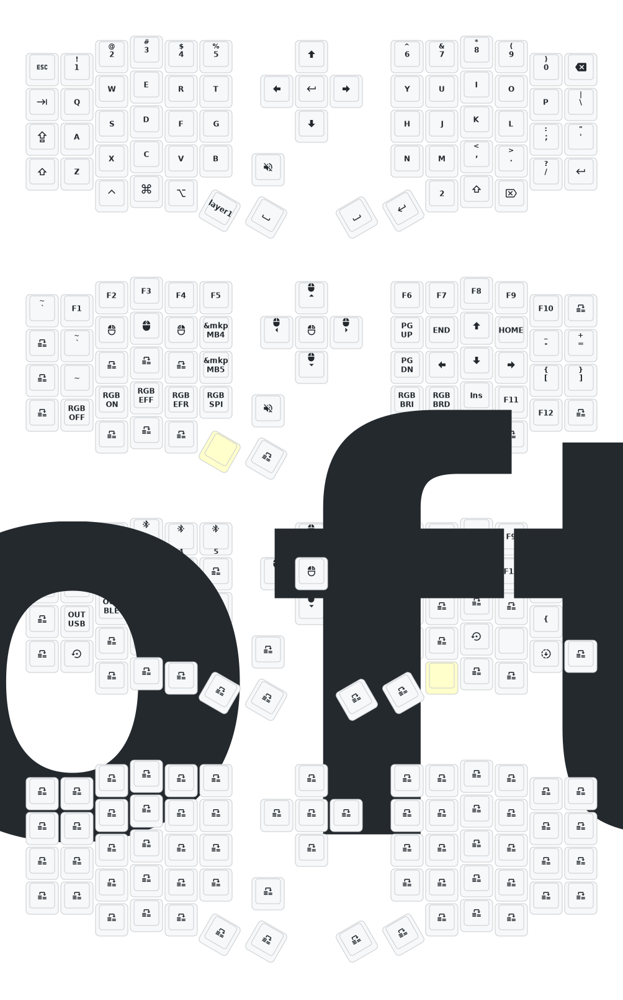

# Update List

- 2024/12/21
  1. Added support for zmk-studio (just refresh the left hand to use).
- 2024/10/24
  1. Modified power supply mode to reduce power consumption.
  2. Fixed the automatic shut-off feature for RGB power supply.

> If your keyboard was updated before October 24, please update to the latest firmware.
> 
---

# Instructions for key mapping
1. Add/Modify mappings in file config/eyelash_sofle.keymap
2. Push the changes to origin (this will generate a new svg with the mappings and the firmaware using Github actions) 

# Sofle Keymap

